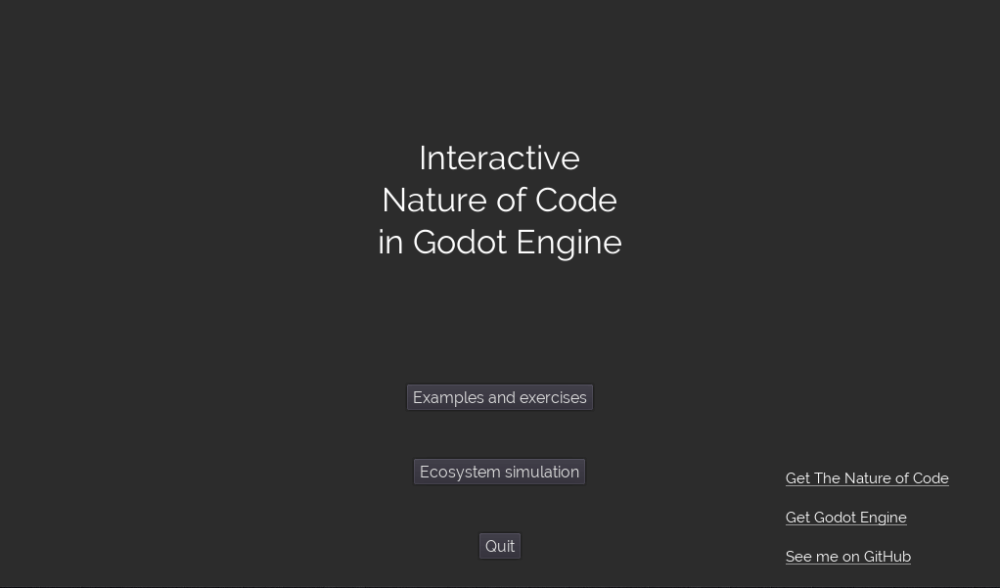

# Nature of Code in Godot

Official book: https://natureofcode.com/book/

## Summary

Each interactive example and interactive exercise will be implemented with Godot Engine 3.2.3-rc3, using C# for the scripting.

The project contain a launcher, with a **scene explorer** to navigate examples and exercises, and the **ecosystem simulation** scene.

Almost everything is created from scripts.

## Features

- Dynamic scene loader to explore examples and exercises
- Simple reusable primitives are available in the `scripts` folder
  - Examples: Canvas, Attractors, Zones, Springs, Particles, Waves, etc.
- The Physics Libraries chapter is using the Godot internal physics engine instead of Box2D
- A simple Verlet physics implementation can be found in `scripts/verletphysics`
- Most C# code is documented with Doxygen, you can use the included Doxyfile to generate documentation
- Drawing is often batched (using GLES2 batching) to ensure correct performance on mobile and web targets

## Roadmap

- [ ] Implement missing examples and exercises.
- [ ] Implement the full Ecosystem project

## Generate documentation

Documentation is generated with Doxygen from C# XML comments.
Use the included Doxyfile to generate HTML documentation in the ./html folder.